# BEDU - PROGRAMACIÓN CON JAVA
Entrega de proyectos para Bedu del curso Programación con Java.

---

## UNIDAD 1 - SESIÓN 1 - RETO 1

### 🎯 Objetivo

⚒️ Desarrollar un programa en **Java** que registre los datos de un paciente, aplicando los fundamentos de **clases**, **objetos**, **atributos**, **métodos** y la **entrada de datos por consola**.

#### 🏆 Evidencias:

<b>Capturas de clases<b>

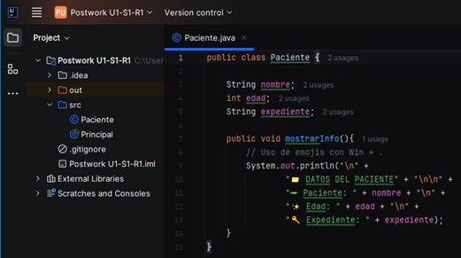

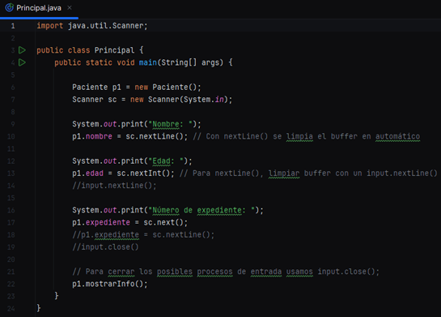

<b>Salidas<b>

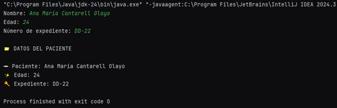

---

## UNIDAD 1 - SESIÓN 1 - RETO 2

### 🎯 Objetivo

⚒️ Desarrollar un programa en **Java** que permita registrar la información básica de entradas para eventos, aplicando los fundamentos de **clases**, **objetos**, **atributos**, **métodos** y el uso de **constructores**.

#### 🏆 Evidencias:

<b>Capturas de clases y salidas correspondientes a "Clase normal"<b>

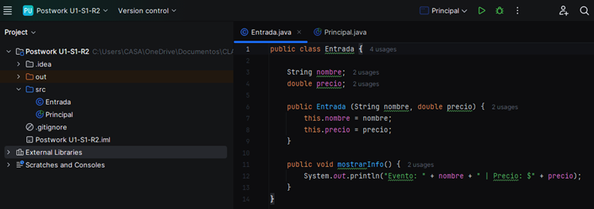

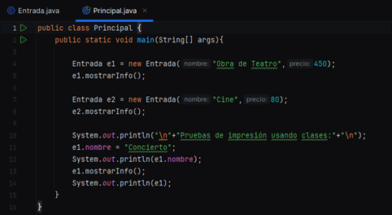

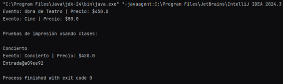

<b>Capturas de clases y salidas correspondientes a "Record"<b>

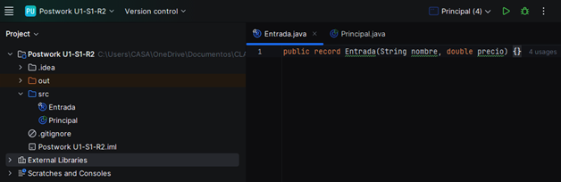

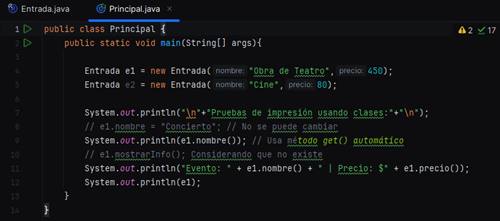

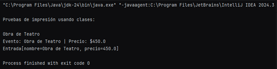

<b>Capturas de clases y salidas correspondientes a "Record con método"<b>

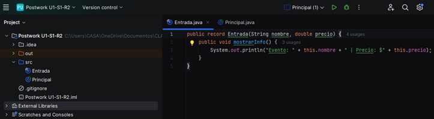

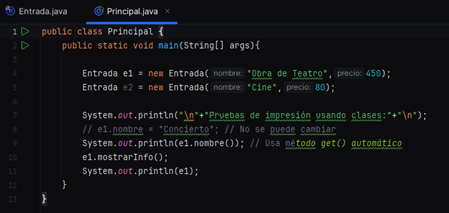

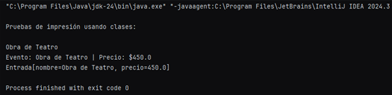

---

## UNIDAD 1 - SESIÓN 2 - RETO 1

### 🎯 Objetivo

⚒️ Desarrollar un programa que calcule el total de una compra en farmacia y aplique un descuento si supera cierta cantidad. Este reto refuerza el uso de **operadores aritméticos**, **asignación**, **entrada por consola**, e **inferencia de tipo con `var`**.

#### 🏆 Evidencias:

<b>Capturas de clase y salida<b>

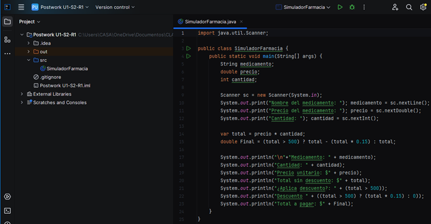

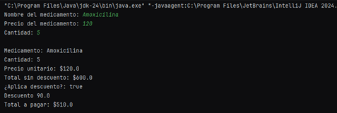

---

## UNIDAD 1 - SESIÓN 2 - RETO 2

## 🎯 Objetivo

💻 Implementar un programa que simule un **cajero automático básico**, aplicando estructuras de control como `while`, `switch`, `break` y `continue` para navegar entre opciones y validar operaciones del usuario.

#### 🏆 Evidencias:

<b>Captura de clase<b>

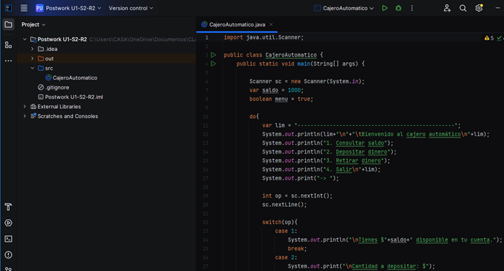

<b>Elige una operación y realizar una segunda operación<b>

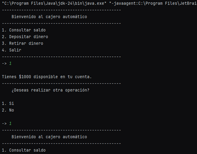

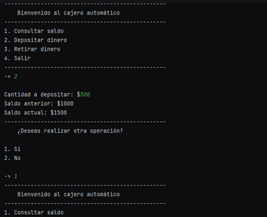

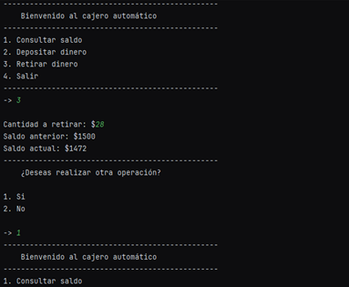

<b>Elige retirar sin saldo suficiente como operación y no realizar una segunda operación<b>

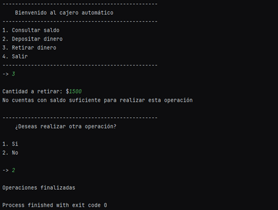

<b>Elige salir del menú sin hacer operaciones<b>

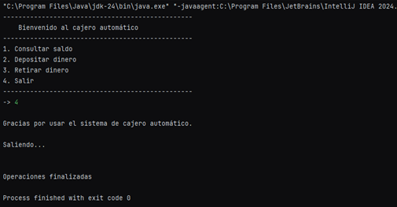

---

## UNIDAD 1 - SESIÓN 3 - RETO 1

### 🎯 Objetivo

Diseñar un sistema básico de **reservas de vuelo** aplicando los fundamentos de la **Programación Orientada a Objetos** en Java. Practicarás la **creación de clases y objetos**, el uso de **atributos `static` y `final`**, así como la definición de **métodos con parámetros y valores de retorno**.

#### 🏆 Evidencias:

<b>Capturas de clases<b>

<b>Salidas<b>

---

## UNIDAD 1 - SESIÓN 3 - RETO 2

### 🎯 Objetivo

Diseñar una clase `Factura` aplicando los principios de **encapsulación con modificadores de acceso** y utilizando la clase **`Optional`** para manejar valores que pueden ser nulos, como el RFC del cliente.

#### 🏆 Evidencias:

<b>Capturas de clases<b>

<b>Salidas<b>

---

## UNIDAD 1 - SESIÓN 4 - RETO 1

### 🎯 Objetivo

💼 Modelar facturas emitidas para un sistema contable, reforzando el uso de **constructores**, `equals()`, `hashCode()` y `toString()`.

#### 🏆 Evidencias:

<b>Capturas de clases<b>

<b>Salidas<b>

---

## UNIDAD 1 - SESIÓN 4 - RETO 2

### 🎯 Objetivo

📄 Modelar una declaración de impuestos con `record` y validarla contra una cuenta fiscal usando encapsulación y comparación segura con `Objects.equals()`.

#### 🏆 Evidencias:

<b>Capturas de clases<b>

<b>Salidas<b>

---

## UNIDAD 1 - SESIÓN 5 - RETO 1

### 🎯 Objetivo

Construir un sistema que modele diferentes tipos de **unidades de emergencia**, aplicando los principios de **herencia** y **composición** en Java. Reforzarás el uso de `extends`, `super`, y el diseño modular usando clases auxiliares.

#### 🏆 Evidencias:

<b>Capturas de clases<b>

<b>Salidas<b>

---

## UNIDAD 1 - SESIÓN 5 - RETO 2

### 🎯 Objetivo

Diseñar un sistema de pagos en el que distintos métodos de pago (efectivo, tarjeta, transferencia) compartan una estructura común pero tengan comportamientos específicos. Aplicarás el uso de **interfaces**, **clases abstractas**, y **polimorfismo** para modelar un flujo flexible y extensible.

#### 🏆 Evidencias:

<b>Capturas de clases<b>

<b>Salidas<b>

---

## UNIDAD 1 - SESIÓN 6 - RETO 1

### 🎯 Objetivo 

Practicar el uso de `ArrayList`, `HashSet` y `HashMap` en un contexto profesional relacionado con la biotecnología, para registrar muestras, identificar elementos únicos y asociar datos clave.

#### 🏆 Evidencias:

<b>Capturas de clases<b>

<b>Salidas<b>

---

## UNIDAD 1 - SESIÓN 6 - RETO 2

### 🎯 Objetivo 

Practicar el uso de:

- `Comparable` y `Comparator` para ordenar temas de clase.
- `CopyOnWriteArrayList` para gestionar de forma segura una lista de temas activos.
- `ConcurrentHashMap` para mantener un repositorio de recursos compartidos por tema, accesible de forma segura desde distintos usuarios.

#### 🏆 Evidencias:

<b>Capturas de clases<b>

<b>Salidas<b>

---

## UNIDAD 1 - SESIÓN 7 - RETO 1

### 🎯 Objetivo

🧠 Aplicar las clases `Path` y `Files` de la API `java.nio.file` (NIO.2) para crear un archivo de configuración de simulación, verificar su existencia y leer su contenido. Este ejercicio simula una tarea real del rol de **Process Simulation Engineer**, donde se documentan los parámetros antes de ejecutar una corrida de simulación.

#### 🏆 Evidencias:

<b>Capturas de clases<b>

<b>Salidas<b>

---

## UNIDAD 1 - SESIÓN 7 - RETO 2

### 🎯 Objetivo

🧠 Aplicar el uso de `BufferedReader`, `try-with-resources` y manejo de excepciones para analizar grandes archivos de logs generados por pruebas automatizadas. Este reto simula una tarea del rol de **Automated Testing Engineer (QA)**, enfocada en el procesamiento eficiente de información y la trazabilidad de errores.

#### 🏆 Evidencias:

<b>Capturas de clases<b>

<b>Salidas<b>

---

## UNIDAD 1 - SESIÓN 8 - RETO 1

### 🎯 Objetivo

🧠 Aplicar **refactorización** y los **principios SOLID** en un caso práctico relacionado con videojuegos narrativos, separando responsabilidades y utilizando interfaces para lograr un sistema escalable y mantenible.

#### 🏆 Evidencias:

<b>Capturas de clases<b>

<b>Salidas<b>

---

## UNIDAD 1 - SESIÓN 8 - RETO 2

### 🎯 Objetivo

🧠 Desarrollar una herramienta en Java que permita leer registros de consumo de CPU por servidor, identifique duplicados, valide entradas numéricas y lance una excepción personalizada si se supera un umbral crítico. Se deben aplicar las buenas prácticas de rendimiento, manejo de errores y excepciones personalizadas.

#### 🏆 Evidencias:

<b>Capturas de clases<b>

<b>Salidas<b>

---

## UNIDAD 2 - SESIÓN 1 - RETO 2

---

## UNIDAD 2 - SESIÓN 2 - RETO 1

---

## UNIDAD 2 - SESIÓN 2 - RETO 2

---

## UNIDAD 2 - SESIÓN 3 - RETO 1

---

## UNIDAD 2 - SESIÓN 3 - RETO 2

---

## UNIDAD 2 - SESIÓN 4 - RETO 1

---

## UNIDAD 2 - SESIÓN 4 - RETO 2

---

## UNIDAD 2 - SESIÓN 5 - RETO 1

---

## UNIDAD 2 - SESIÓN 5 - RETO 2

---

## UNIDAD 2 - SESIÓN 6 - RETO 1

---

## UNIDAD 2 - SESIÓN 6 - RETO 2

---

## UNIDAD 2 - SESIÓN 7 - RETO 1

---

## UNIDAD 2 - SESIÓN 7 - RETO 2

---

## UNIDAD 2 - SESIÓN 8 - RETO 1

---

## UNIDAD 2 - SESIÓN 8 - RETO 2

